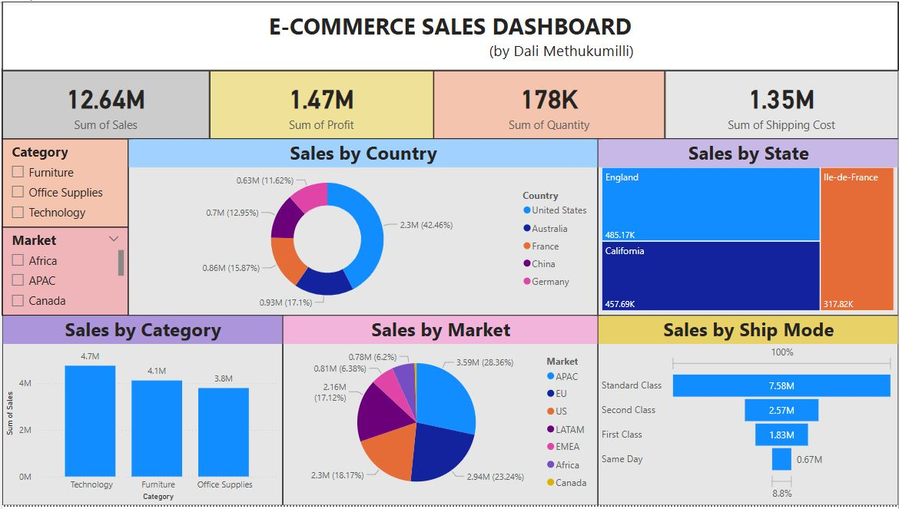

# 📊 E-Commerce Sales Dashboard | Power BI Project

## Project Overview
This project showcases the power of data visualization in business and data analytics.  
I built a comprehensive **E-Commerce Sales Dashboard** using **Microsoft Power BI** to help businesses gain insights into their sales performance across multiple dimensions.

## 📝 Problem Statement
An e-commerce company needed better visibility into their sales performance across countries, states, product categories, and shipping methods to make informed strategic decisions.

## 🔥 Key Highlights
- Analyzed **sales**, **profit**, **quantity**, and **shipping costs** across multiple geographies.
- Visualized performance across different **categories** (Furniture, Technology, Office Supplies) and **shipping methods** (Standard, Second Class, First Class, Same Day).
- Built dynamic, interactive visuals for storytelling and better decision-making.
- Developed practical skills in **Power BI dashboarding**, **data modeling**, and **data visualization**.

## 📈 Key Insights
- 🇺🇸 **United States** contributed the highest sales volume (42.46%).
- 🖥️ **Technology** emerged as the top-performing product category.
- 🚚 **Standard Class** was the most used shipping method.
- 🗺️ Top performing regions included **England**, **California**, and **Ile-de-France**.

## 🛠️ Tools and Skills Used
- **Microsoft Power BI** (Data Modeling, DAX, Visualizations)
- **Excel** (Data Preparation and Cleaning)
- **Data Storytelling** and **Business Intelligence**

## 📸 Dashboard Preview

)

## 📁 Dataset
The dataset used in this project is available here:

- [Download E-Commerce Dataset](ECOMM DATA.xlsx)

## 🚀 Future Enhancements
- Adding **time series analysis** and **forecasting**.
- Building **advanced KPIs** like Customer Lifetime Value (CLTV) and Return Rates.
- Enhancing with **RLS (Row-Level Security)** for user-specific reporting.

## 📬 Contact
Let's connect!  
- [LinkedIn](#) (https://www.linkedin.com/in/dali-naga-sri-sai-m-384173190/)

---
